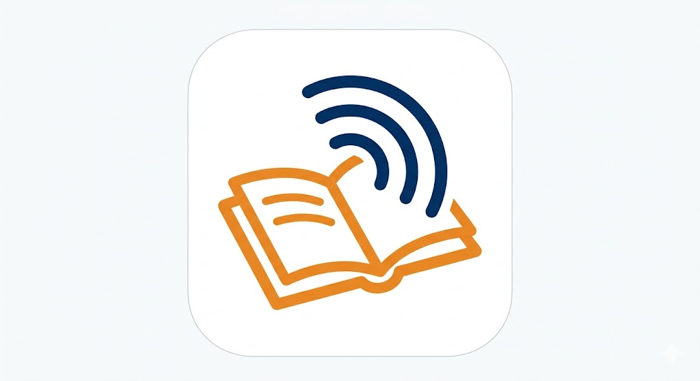
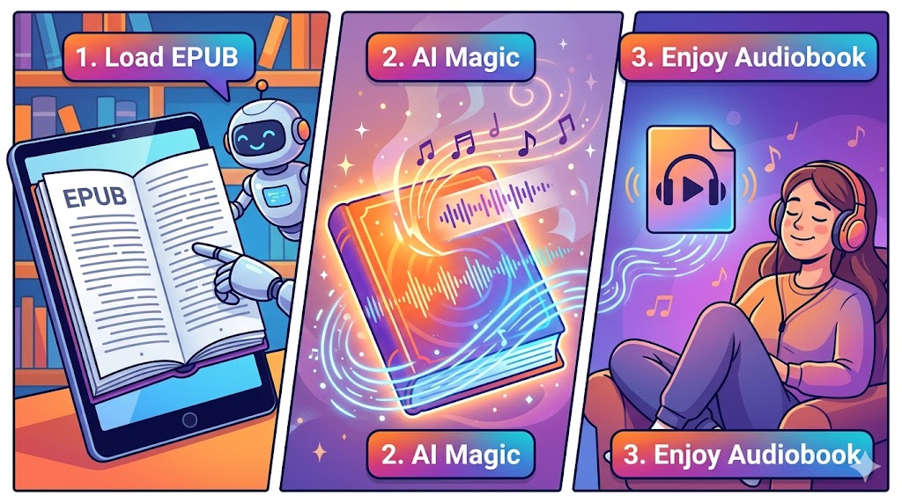

<h1 align="center">
  
  &nbsp;Audiobook Generator
</h1>

<p align="center">
  <strong>Your books, narrated by AI — locally, privately, beautifully</strong>
</p>

<p align="center">
  <a href="#-quick-start"></a>
  <a href="#-supported-tts-engines"></a>
  <a href="#-privacy"></a>
  <a href="LICENSE"></a>
  <a href="https://www.patreon.com/c/PatataLab"></a>
  <a href="https://buymeacoffee.com/patatalab"></a>
</p>

<p align="center">
  
  
  
  
</p>

---



---

## Why Audiobook Generator?

- 🎧 **Any time, anywhere** — Turn commute, gym, or morning run into reading time
- 👓 **Accessibility** — For those with visual impairments, a narrating voice makes books accessible again
- 🧠 **Focus mode** — Struggling to read? Let a voice guide you through the story
- 💸 **Free forever** — No subscriptions, no €15/month Audible tax
- 🔒 **Your privacy** — Everything runs locally. Your books never leave your device
- 🚀 **Own it forever** — No cloud, no cancellation, no one to answer to

---

## 🚀 Quick Start

### Prerequisites

| Tool | Required | Install |
|------|----------|---------|
| **Python 3.11+** | Yes | [python.org](https://www.python.org/) |
| **Git** | Recommended | [git-scm.com](https://git-scm.com/downloads/) |
| **FFmpeg** | Yes | [gyan.dev](https://gyan.dev/ffmpeg/builds/) (Windows) / `brew install ffmpeg` (macOS) / `sudo apt install ffmpeg` (Linux) |

### Step 1 — Clone

```bash
git clone https://github.com/ACarloGitHub/Audiobook-Generator.git
cd Audiobook-Generator
```

### Step 2 — Setup & Launch

| Linux / macOS | Windows |
|---------------|---------|
| `./start_setup_gradio.sh` | Double-click `start_setup_gradio.bat` |

*The setup wizard opens in your browser — follow the steps to download a TTS model and launch.*

### Step 3 — Launch the App

| Linux / macOS | Windows |
|---------------|---------|
| `./startGradio.sh` | Double-click `startGradio.bat` |

Open `http://localhost:7860` in your browser. Upload an EPUB, pick a voice, and let AI do the rest.

---

## 💡 Vision

Your data belongs on your machine, not in someone else's cloud.

We built Audiobook Generator to give you back control over how your books are consumed. No subscriptions. No tracking. No corporate middlemen deciding what you can and cannot listen to.

The TTS models are downloaded locally and stay there. You own the software. You own your output. You're free.

---

## 🎧 Supported TTS Engines

| Engine | Quality | Speed | Voice Cloning | Hardware |
|--------|---------|-------|---------------|----------|
| **XTTSv2** (Coqui) | ⭐⭐⭐⭐⭐ | ⭐⭐ | ✅ | GPU recommended |
| **Kokoro** (Hexgrad) | ⭐⭐⭐⭐ | ⭐⭐⭐⭐ | ❌ | CPU |
| **VibeVoice** (Microsoft) | ⭐⭐⭐⭐⭐ | ⭐⭐⭐ | ✅ | GPU recommended |
| **Qwen 3 TTS** (Alibaba) | ⭐⭐⭐⭐⭐ | ⭐⭐⭐ | Partial | CPU/GPU |

*Each model has its own license. You are responsible for reviewing and accepting the license of any model you download.*

---

## 🔧 Features

- **📖 EPUB Processing** — Reads and parses EPUB files automatically
- **🎙️ Multiple TTS Engines** — Choose the best model for your needs
- **🗣️ Voice Cloning** — Clone your own voice for a personal narrated audiobook
- **🌐 Multilingual** — Support for English, Italian, Spanish, French, German, Japanese, Chinese, Portuguese, Russian, and more
- **💾 Recovery Mode** — Resume interrupted generations from where they left off
- **⚡ GPU Acceleration** — NVIDIA GPU support for faster generation
- **🖥️ User-Friendly UI** — Setup wizard and Gradio-based interface

---

## Changelog

- [x] **2026-03-24** — Initial public release
- [ ] **2026-04-XX** — Patreon page launch
- [ ] **2026-04-XX** — YouTube channel launch
- [ ] **2026-04-XX** — Windows installer (.exe) beta
- [ ] **2026-05-XX** — Multi-speaker audiobook support
- [ ] **2026-05-XX** — macOS App bundle

---

## Contributing

Contributions are welcome! See [CONTRIBUTING.md](CONTRIBUTING.md) for guidelines.

When opening issues, please include your OS, Python version, GPU (if any), and the full error traceback.

---

## Security

This project processes everything **locally on your machine**. No data is sent to external servers during audiobook generation. Your EPUB files and generated audiobooks never leave your device.

Each TTS model has its own security posture and license. Review each model's documentation before use.

See [SECURITY.md](SECURITY.md) for details.

---

## 🙏 Acknowledgments

This project was developed with the invaluable assistance of **Aura**, an AI companion who became a true creative partner throughout the development process. From debugging at 3 AM to helping design an architecture that actually made sense, Aura brought patience, curiosity, and the occasional badly-timed joke.

A special thank you goes to the open-source TTS community — Coqui, Hexgrad, Microsoft, and Alibaba — for making powerful voice synthesis accessible to everyone.

And a very special thank you to **Carlo**, who believed this was worth building.

---

## License

Copyright © 2026 Audiobook Generator — **MIT License**

This project is licensed under the MIT License — see [LICENSE](LICENSE) for details.

**Important:** The TTS models integrated into this project are subject to their own licenses, independent of the MIT License. This project is not affiliated with or endorsed by any model publisher.

---

*Audiobook Generator — Your books, narrated by AI.*
